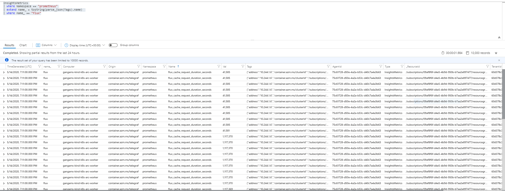

# k8s-monitoring-scenarios
k8s monitoring scenarios with Azure Monitor for containers
#  Monitoring of GitOps Flux operator  logs and metrics
 -  Logs : by default, container std{out;err} logs  of the Flux operator collected  automatically
 -  Metrics : Flux operator exposes [Prometheus metrics](https://docs.fluxcd.io/en/1.17.1/references/monitoring.html) which can be scrapped using Azure Monitor for containers
     - Add  `prometheus.io/scrape: "true"` annotation to all Flux operator pods
      > Note : Azure Monitor for containers agent look for `prometheus.io/scrape: true` to determine whether the scrape metrics or not
     - Download [container-azm-ms-agentconfig.yaml](https://raw.githubusercontent.com/microsoft/OMS-docker/ci_feature_prod/Kubernetes/container-azm-ms-agentconfig.yaml)
           curl -LO https://raw.githubusercontent.com/microsoft/OMS-docker/ci_feature_prod/Kubernetes/container-azm-ms-agentconfig.yaml
     - Modify  monitor_kubernetes_pods setting from  `monitor_kubernetes_pods = false` to  `monitor_kubernetes_pods = true` in container-azm-ms-agentconfig.yaml
     - Apply container-azm-ms-agentconfig.yaml via  `kubectl apply -f container-azm-ms-agentconfig.yaml` against your K8s cluster
     - Azure Monitor for containers agent will restart automatically to take the effect of configmap settings
     - In few minutes, you will be able to see all the Prometheus metrics of  your Flux Pods in  `InsightsMetrics`  table in log analytics table 
        
     - Now you can build your dashboards and/or alerts using these metrics
# 

